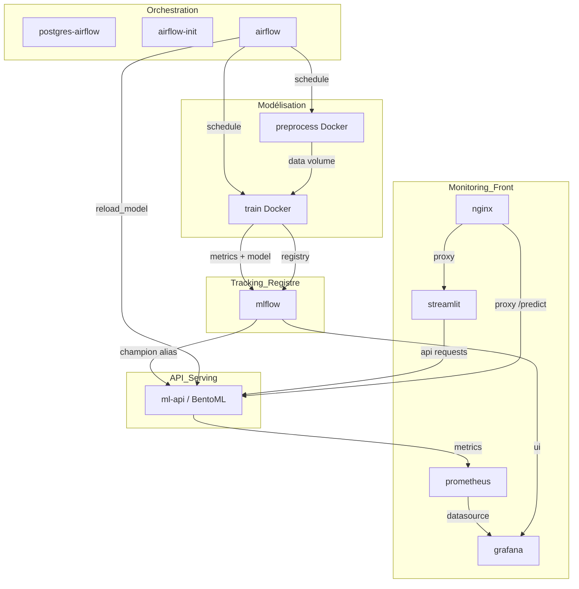

# Pipeline MLOps - Prédiction de la Gravité des Accidents

Ce dépôt met en place un pipeline MLOps pour classer la gravité d’un accident de la route à partir de données ouvertes. Il combine ingestion, préparation, entraînement automatique, tracking MLflow, déploiement BentoML et monitoring.

## 1. Architecture et Schéma du Projet

Ce dépôt implémente un pipeline MLOps complet pour la prédiction de la gravité d’un accident routier. Le flux combine :

- un entraînement autonome piloté par Airflow,
- un suivi et un registre de modèles avec MLflow,
- un service de prédiction BentoML exposé via une API,
- un déploiement continu du modèle par rechargement à chaud,
- un monitoring Prometheus/Grafana et une interface utilisateur Streamlit.



## 2. Structure du Repository

├── LICENSE
├── README.md                        <- Documentation technique MLOps du projet
├── docker-compose.yml               <- Orchestration des services Docker
├── Dockerfile.airflow                <- Image Airflow utilisée pour le scheduler et le webserver
├── dags/                             <- DAG Airflow principal pour le pipeline
│   └── pipeline_accidents.py         <- Orchestration des tâches preprocess/train/evaluate/promote/reload
├── data/                             <- Données et volumes partagés utilisés par le pipeline
├── mlruns/                           <- Artefacts et métadonnées MLflow
├── src/                              <- Code source applicatif
│   ├── bentoml/                      <- Service de prédiction BentoML + Dockerfile
│   ├── preprocess/                   <- Préparation des données + Dockerfile
│   ├── train/                        <- Entraînement du modèle + Dockerfile
│   ├── streamlit/                    <- Application Streamlit frontend
│   ├── nginx/                        <- Reverse proxy Nginx et configuration HTTPS
│   └── prometheus/                   <- Configuration Prometheus
├── grafana/                          <- Dashboards et datasources Grafana

## 3. Fonctionnement du Pipeline (Workflow Airflow)

Le DAG `mlops_accident_gravity_pipeline` orchestre les étapes suivantes :

1. `preprocess` : exécution d’un container Docker `mlops_accidents-preprocess:latest` qui prépare les données et alimente le volume partagé `accidents-data`.
2. `train` : exécution d’un container Docker `mlops_accidents-train:latest` qui entraîne un modèle et enregistre les métriques dans MLflow.
3. `evaluate_metrics` : tâche Python qui lit le dernier `run` MLflow, vérifie le `f1_score`, compare au modèle en production et bloque la promotion si la qualité chute.
4. `promote_model` : tâche Python qui tague la dernière version validée du modèle MLflow avec l’alias `champion` dans le Registry.
5. `reload_predict_service` : tâche Python qui appelle l’endpoint `POST /reload_model` du service `ml-api` pour recharger le modèle en mémoire.

### Stratégie de déploiement

Le service `ml-api` basé sur BentoML expose un endpoint interne `/reload_model`. Après promotion du modèle dans MLflow, Airflow appelle cet endpoint pour forcer une relecture du modèle `Modèle_Gravité_Accidents@champion` sans redémarrage de conteneur.

## 4. Guide de Démarrage Rapide

### Prérequis

- Docker Desktop (WSL2 sous Windows)
- Docker Compose
- Git

### Commandes principales

1. Build initial des images d'entraînement :

```bash
docker compose build
```

2. Lancement de la stack complète :

```bash
docker compose up -d
```

3. Vérification de l'état des conteneurs :

```bash
docker compose ps
```

4. Consultation des logs (ex : Airflow ou ml-api) :

```bash
docker compose logs -f ml-api
```

5. Arrêt et nettoyage complet (volumes inclus) :

```bash
docker compose down -v
```

## 5. Accès aux Interfaces (URLs et Ports)


| Service               | URL                                                                                    | Identifiants / Notes | Rôle                                            |
| --------------------- | -------------------------------------------------------------------------------------- | -------------------- | ------------------------------------------------ |
| Airflow Webserver     | http://localhost:8080                                                                  | admin / admin        | Orchestration du pipeline et exécution des DAGs |
| MLflow Tracking UI    | http://localhost:5000                                                                  | -                    | Suivi des expériences et modèle MLflow         |
| API BentoML / Swagger | via Nginx : https://localhost (port 443) / direct conteneur : non exposé publiquement | -                    | Service de prédiction et endpoint`/predict`     |
| Interface Streamlit   | via Nginx : https://localhost (port 443)                                               | -                    | UI de saisie et démonstration de prédiction    |
| Grafana               | http://localhost:3000                                                                  | admin / admin        | Dashboard de monitoring Prometheus               |
| Prometheus            | http://localhost:9090                                                                  | -                    | Collecte des métriques BentoML                  |

> En production, Nginx reverse-proxy les services Streamlit et ml-api sur HTTP/HTTPS.
